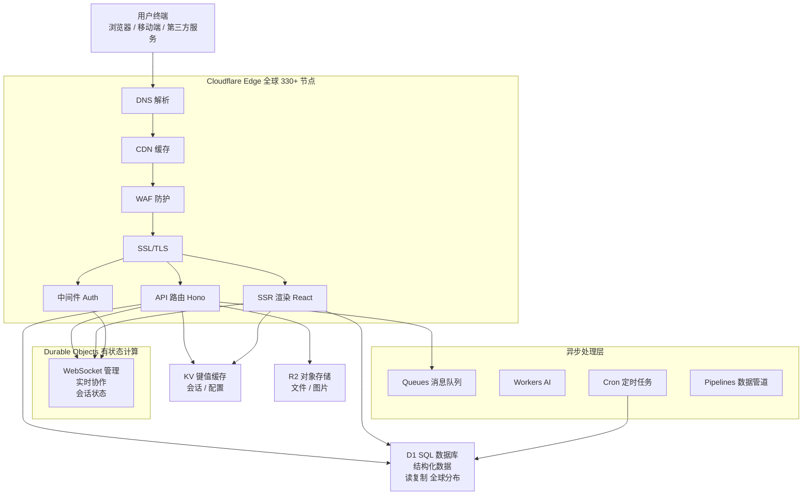
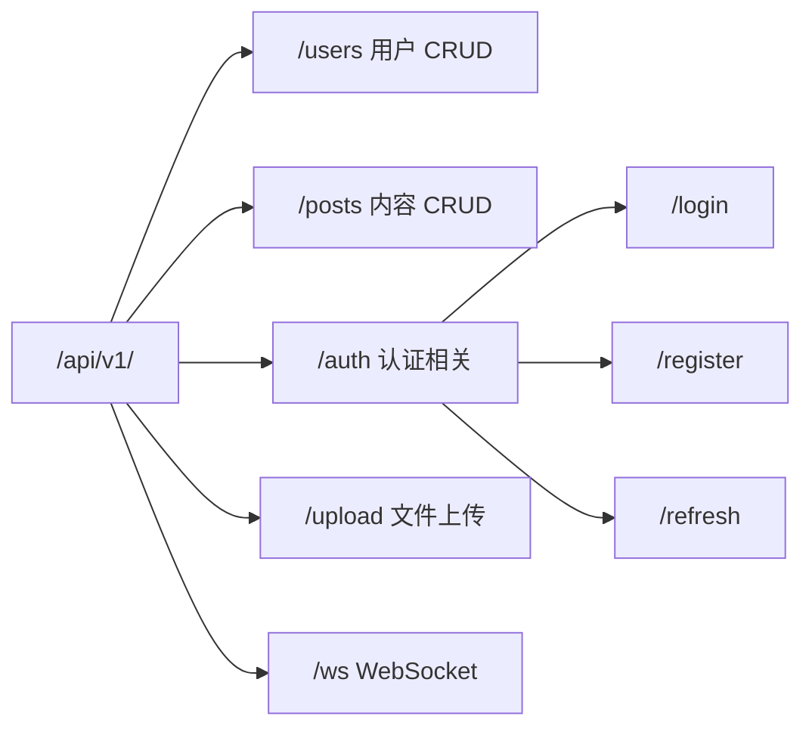
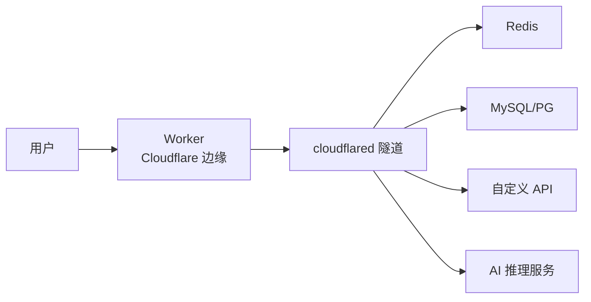
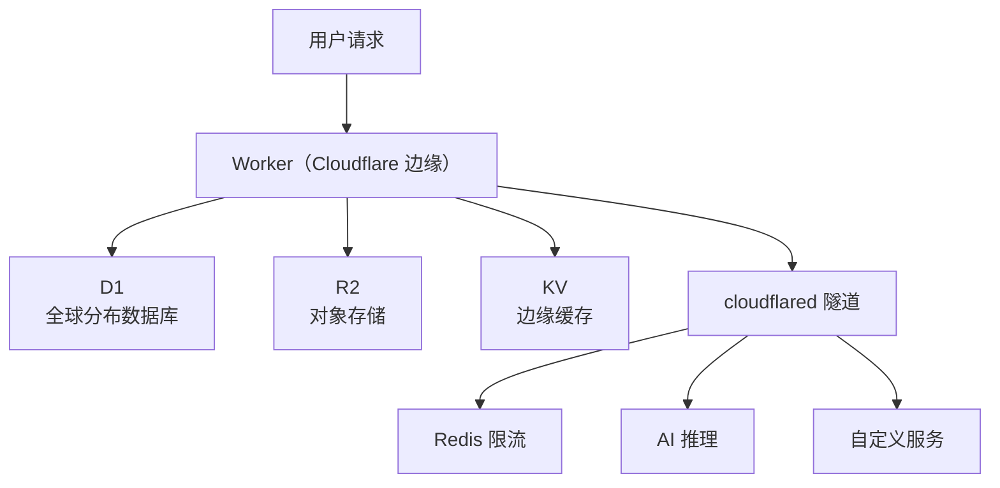
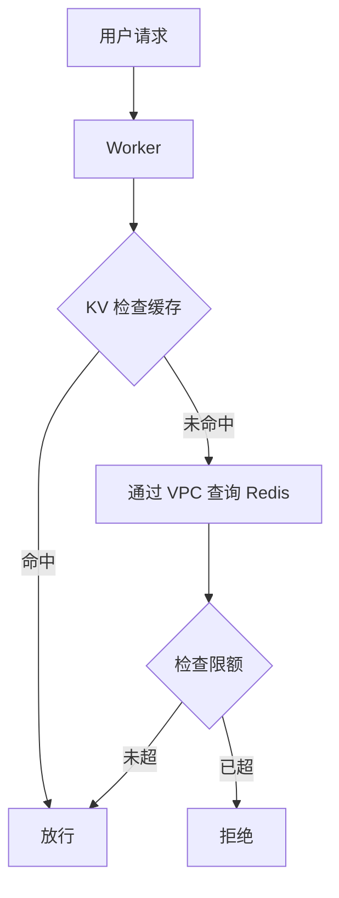
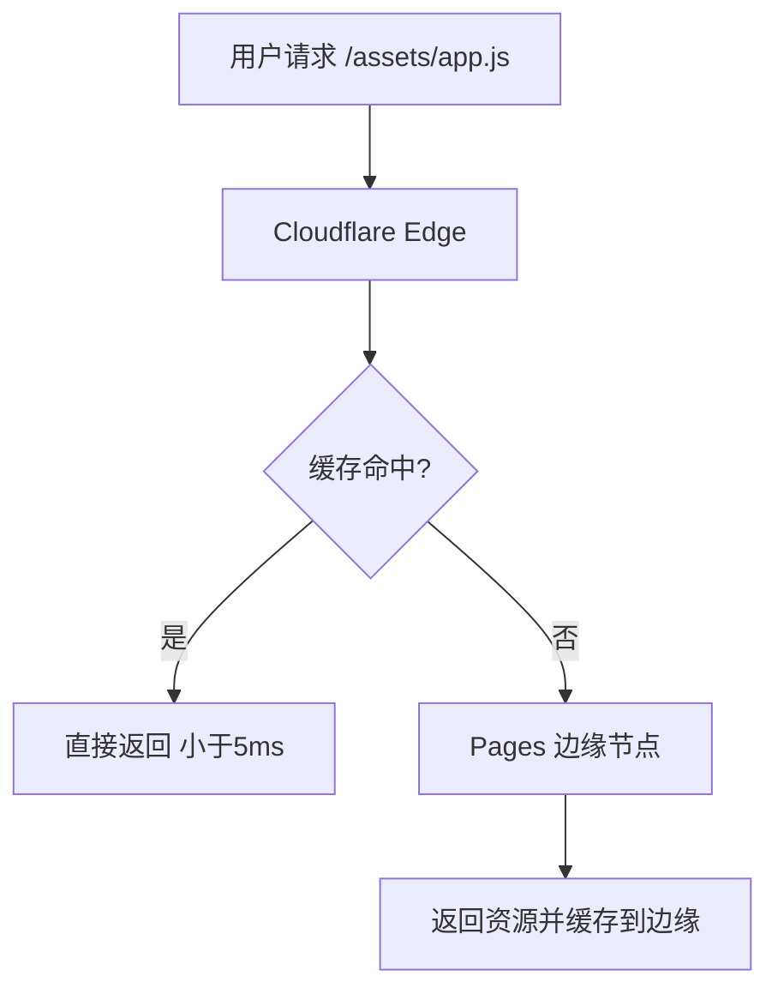
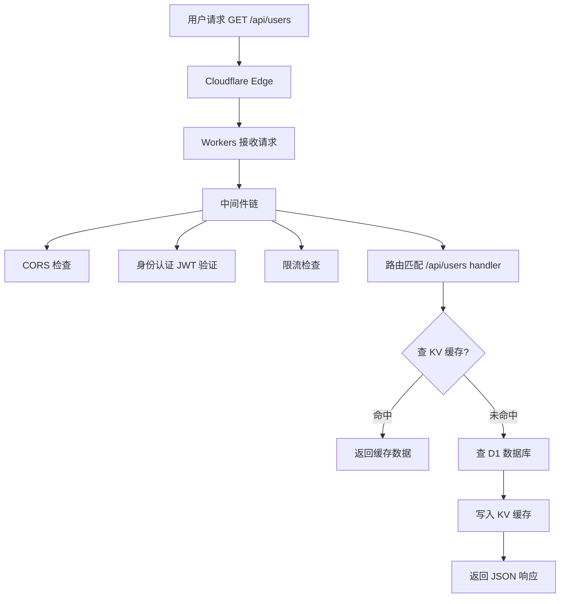
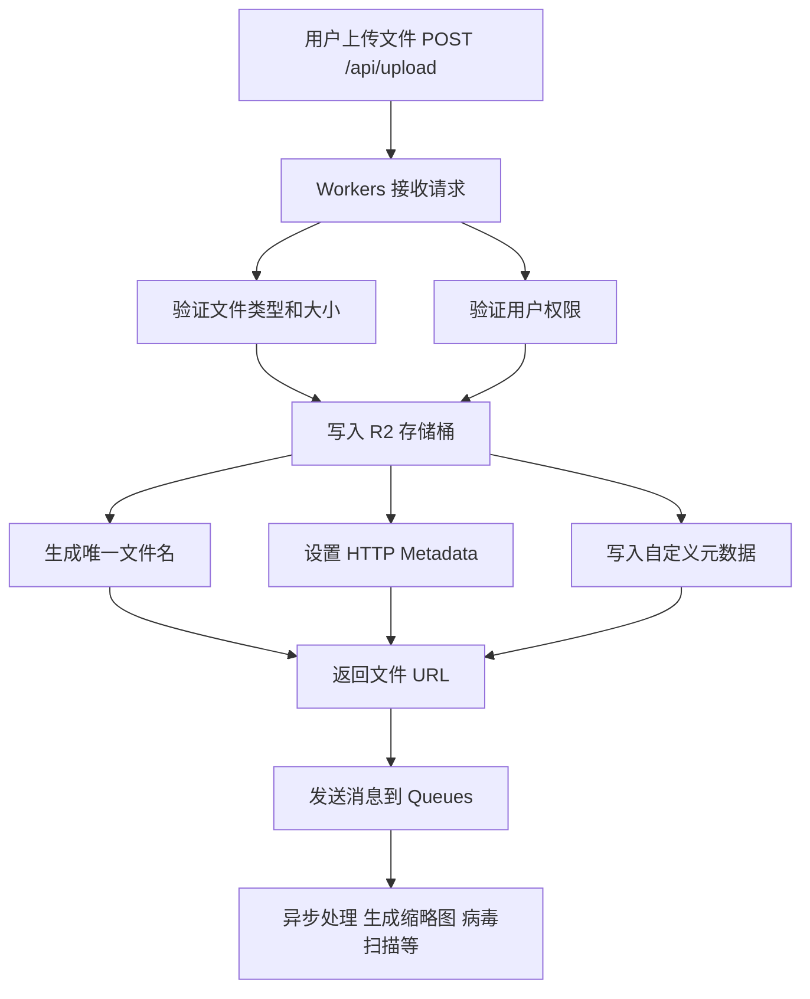
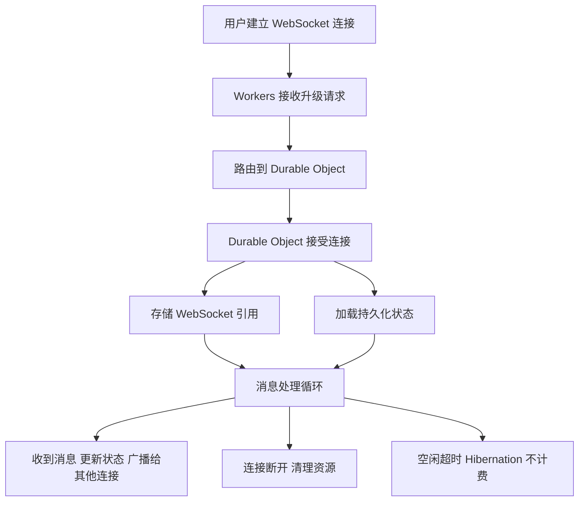

# 如何玩 Cloudflare
---
title: Cloudflare 全栈应用技术架构指南
description: 详细介绍如何在 Cloudflare 平台上构建现代化全栈应用，包括架构设计、产品选型、最佳实践和成本分析
author: MiMoCode
date: 2026-06-23
version: 1.0
---

# Cloudflare 全栈应用技术架构指南

## 目录

1. [概述](#1-概述)
2. [Cloudflare 核心产品矩阵](#2-cloudflare-核心产品矩阵)
3. [典型技术架构](#3-典型技术架构)
4. [各层详细设计](#4-各层详细设计)
5. [Workers VPC 私有网络接入](#5-workers-vpc-私有网络接入)
6. [数据流与请求处理流程](#6-数据流与请求处理流程)
7. [推荐技术栈](#7-推荐技术栈)
8. [项目结构示例](#8-项目结构示例)
9. [与传统架构对比](#9-与传统架构对比)
10. [定价与成本分析](#10-定价与成本分析)
11. [限制与注意事项](#11-限制与注意事项)
12. [最佳实践](#12-最佳实践)
13. [本地离线开发](#13-本地离线开发)
14. [适用场景与不适用场景](#14-适用场景与不适用场景)
15. [参考资料](#15-参考资料)

---

## 1. 概述

### 1.1 什么是 Cloudflare Developer Platform

Cloudflare 最初以 CDN 和安全防护闻名，如今已发展为一个完整的 **边缘计算平台（Developer Platform）**。它提供了一整套无服务器产品，让开发者可以在全球 330+ 个边缘节点上构建、部署和运行应用程序，无需管理任何服务器基础设施。

### 1.2 核心优势

- **全球边缘部署**：代码运行在离用户最近的节点，延迟 < 50ms
- **零流量费用**：所有产品均不收取出站带宽费用（egress free）
- **自动扩展**：无需配置，自动应对流量高峰
- **零运维**：无需管理服务器、操作系统、运行时环境
- **统一平台**：计算、存储、数据库、AI 在同一平台内闭环

### 1.3 适用定位

Cloudflare Developer Platform 最适合构建以下类型的应用：

- 内容密集型网站（博客、文档站、营销页面）
- API 驱动的 Web 应用
- 轻量级 SaaS 应用
- 实时协作应用（聊天、编辑器、白板）
- AI 驱动的应用（RAG、推理、Agent）

---

## 2. Cloudflare 核心产品矩阵

### 2.1 计算层

| 产品 | 定位 | 运行时 | 说明 |
|------|------|--------|------|
| **Workers** | 核心计算引擎 | V8 Isolate | 无服务器函数，支持 JS/TS/Wasm，单次 CPU 时间最长 5 分钟 |
| **Pages** | 前端托管 | 静态资源 | 自动 CI/CD，支持 SSR（通过 Functions） |
| **Durable Objects** | 有状态计算 | V8 Isolate | 提供持久化状态、WebSocket 管理、协调原语 |
| **Containers** | 容器运行时 | Docker | 2025 年新增，支持任意容器化应用 |
| **Workflows** | 工作流引擎 | - | 长时间运行的编排任务，支持重试和持久化 |

### 2.2 数据库层

| 产品 | 定位 | 数据模型 | 说明 |
|------|------|----------|------|
| **D1** | 关系型数据库 | SQLite | 全球分布的 Serverless SQL，支持读复制 |
| **KV** | 键值存储 | Key-Value | 高读取、低写入场景，最终一致性 |
| **Durable Objects Storage** | 嵌入式存储 | SQLite / KV | 与 Durable Object 实例绑定的本地存储 |
| **Hyperdrive** | 数据库代理 | - | 加速对远程 PostgreSQL/MySQL 的访问 |

### 2.3 存储层

| 产品 | 定位 | 说明 |
|------|------|------|
| **R2** | 对象存储 | S3 兼容，零出站费用，适合图片/视频/文件 |
| **R2 Data Catalog** | 数据目录 | 在 R2 上构建 Apache Iceberg 数据湖 |
| **Pipelines** | 数据管道 | 实时数据摄入，写入 R2 |

### 2.4 网络与安全层

| 产品 | 定位 | 说明 |
|------|------|------|
| **Tunnels (cloudflared)** | 隧道 | 安全连接后端服务，无需暴露公网端口 |
| **Access** | 零信任访问 | 身份验证网关，保护内部应用 |
| **WAF** | Web 应用防火墙 | 防护 SQL 注入、XSS 等攻击 |
| **Turnstile** | 验证码替代 | 无感验证，替代传统 CAPTCHA |
| **SSL/TLS** | 证书管理 | 自动签发和续期证书 |

### 2.5 AI 层

| 产品 | 定位 | 说明 |
|------|------|------|
| **Workers AI** | 推理平台 | 在边缘运行 LLM、图像生成、语音识别等模型 |
| **Vectorize** | 向量数据库 | 存储和查询向量嵌入，用于 RAG |
| **AI Gateway** | AI 网关 | 统一管理多个 AI 提供商的调用 |
| **AI Search** | 搜索服务 | 基于 AI 的语义搜索 |
| **Browser Rendering** | 浏览器渲染 | 无头浏览器，用于爬取和截图 |

### 2.6 消息与队列

| 产品 | 定位 | 说明 |
|------|------|------|
| **Queues** | 消息队列 | 异步任务处理，支持死信队列 |
| **Email Routing** | 邮件路由 | 接收和转发邮件 |
| **Email Sending** | 邮件发送 | 通过 Workers 发送邮件 |

---

## 3. 典型技术架构

### 3.1 整体架构图



### 3.2 架构分层说明

#### 接入层（Ingress）

用户请求首先到达 Cloudflare 的全球边缘网络。在此层完成：

- **DNS 解析**：Cloudflare 提供全球最快的权威 DNS（DNSPerf 持续排名第一）
- **CDN 缓存**：静态资源直接从边缘节点返回，无需回源
- **WAF 防护**：自动拦截 SQL 注入、XSS、DDoS 等恶意请求
- **SSL/TLS 终止**：自动处理 HTTPS 加密解密

#### 计算层（Compute）

Workers 是核心计算引擎，基于 V8 Isolate 技术，启动时间 < 5ms。在此层处理：

- **API 路由**：接收前端请求，调用后端服务
- **业务逻辑**：数据验证、权限检查、业务处理
- **SSR 渲染**：在边缘执行 React/Vue/Svelte 的服务端渲染
- **中间件**：认证、CORS、日志、限流等横切关注点

#### 状态层（State）

Durable Objects 提供有状态的计算能力：

- **WebSocket 管理**：维护长连接，支持实时通信
- **会话状态**：存储用户会话、购物车等临时状态
- **协调原语**：分布式锁、Leader 选举、计数器

#### 存储层（Storage）

Cloudflare 提供多种存储选择：

- **D1**：关系型数据，适合用户信息、订单、内容等结构化数据
- **KV**：高频读、低频写的缓存数据，如配置、会话、热点数据
- **R2**：文件和对象，如图片、视频、文档、备份

#### 异步层（Async）

后台任务和数据处理：

- **Queues**：异步任务，如发送邮件、生成报告、调用第三方 API
- **Cron Triggers**：定时任务，如数据清理、报表生成、同步
- **Pipelines**：实时数据摄入，将事件流写入 R2

---

## 4. 各层详细设计

### 4.1 前端层

#### 4.1.1 静态资源托管（Cloudflare Pages）

Cloudflare Pages 是专为前端应用设计的托管平台：

- **Git 集成**：连接 GitHub/GitLab，推送到指定分支自动部署
- **预览部署**：每个 PR 自动生成预览 URL，方便团队评审
- **全球 CDN**：静态资源自动分发到全球 330+ 节点
- **自定义域名**：支持自定义域名和自动 SSL 证书

#### 4.1.2 SSR 支持

Pages 支持通过 Functions 实现服务端渲染：

- **Pages Functions**：在 Pages 项目中直接编写后端逻辑
- **框架支持**：Next.js、Nuxt、SvelteKit、Astro 等主流框架均支持
- **边缘渲染**：SSR 在边缘节点执行，首屏加载更快

#### 4.1.3 推荐框架

| 框架 | 特点 | 适用场景 |
|------|------|---------|
| **Astro** | 内容优先，零 JS 默认 | 博客、文档站、营销页 |
| **Next.js** | React 生态，SSR/SSG | 复杂 Web 应用 |
| **SvelteKit** | 轻量，编译时优化 | 性能敏感应用 |
| **Nuxt** | Vue 生态，全栈框架 | Vue 项目 |
| **Remix** | 嵌套路由，数据加载 | 表单密集应用 |

### 4.2 后端 API 层

#### 4.2.1 Workers 运行时

Workers 运行在 V8 Isolate 中，具有以下特点：

- **启动时间**：< 5ms（无冷启动问题）
- **CPU 时间限制**：单次请求最长 5 分钟（Paid 计划）
- **内存**：128MB per Isolate
- **支持语言**：JavaScript、TypeScript、WebAssembly
- **运行时 API**：Fetch、Cache、Crypto、Encoding、Streams 等 Web 标准 API

#### 4.2.2 路由框架

推荐使用轻量级路由框架：

- **Hono**：Cloudflare 官方推荐，类似 Express，支持中间件
- **itty-router**：极简路由，< 1KB
- **Wrangler**：Cloudflare 官方 CLI，内置开发服务器

#### 4.2.3 API 设计模式



### 4.3 数据库层

#### 4.3.1 D1（关系型数据库）

D1 是 Cloudflare 的 Serverless SQLite 数据库：

- **全球分布**：支持读复制，数据自动同步到多个区域
- **SQL 兼容**：完整的 SQL 语法，支持索引、事务、外键
- **Wrangler CLI**：通过命令行管理数据库，支持迁移
- **绑定方式**：在 `wrangler.toml` 中配置，Workers 中直接调用

使用示例：

```sql
-- schema.sql
CREATE TABLE users (
    id INTEGER PRIMARY KEY AUTOINCREMENT,
    email TEXT UNIQUE NOT NULL,
    name TEXT NOT NULL,
    created_at DATETIME DEFAULT CURRENT_TIMESTAMP
);

CREATE INDEX idx_users_email ON users(email);
```

```typescript
// worker/src/api/users.ts
export async function getUsers(env: Env) {
    const { results } = await env.DB.prepare(
        "SELECT * FROM users ORDER BY created_at DESC LIMIT 50"
    ).all();
    return results;
}
```

#### 4.3.2 KV（键值存储）

KV 是最终一致性的全局键值存储：

- **读取延迟**：< 10ms（全球边缘）
- **适用场景**：配置、会话、Feature Flag、缓存
- **数据大小**：单个值最大 25MB
- **一致性**：最终一致性（写入后全球传播需要时间）

使用示例：

```typescript
// 存储会话
await env.SESSIONS.put(`session:${sessionId}`, JSON.stringify(session), {
    expirationTtl: 3600 // 1小时过期
});

// 读取会话
const session = await env.SESSIONS.get(`session:${sessionId}`, "json");
```

#### 4.3.3 D1 vs KV 选择指南

| 特性 | D1 | KV |
|------|----|----|
| 数据模型 | 关系型（SQL） | 键值对 |
| 一致性 | 强一致 | 最终一致 |
| 查询能力 | 复杂查询、JOIN、聚合 | 仅按 Key 查询 |
| 写入性能 | 中等 | 高 |
| 读取性能 | 中等 | 极高（边缘缓存） |
| 适用场景 | 业务数据、关系数据 | 缓存、配置、会话 |

### 4.4 文件存储层

#### 4.4.1 R2 对象存储

R2 是 S3 兼容的对象存储：

- **零出站费用**：不收取数据传输费用，这是与 AWS S3 的最大差异
- **S3 兼容 API**：现有 S3 工具和库可直接使用
- **全球分布**：数据自动复制到多个区域
- **生命周期管理**：支持自动过期和转换

使用示例：

```typescript
// 上传文件
await env.R2_BUCKET.put(`images/${filename}`, file, {
    httpMetadata: { contentType: "image/jpeg" },
    customMetadata: { userId: "123" }
});

// 下载文件
const object = await env.R2_BUCKET.get(`images/${filename}`);
if (object === null) {
    return new Response("Not Found", { status: 404 });
}
return new Response(object.body, {
    headers: { "Content-Type": object.httpMetadata.contentType }
});
```

#### 4.4.2 R2 使用场景

| 场景 | 说明 |
|------|------|
| 用户上传 | 头像、文档、媒体文件 |
| 静态资源 | 图片、字体、CSS/JS |
| 数据备份 | 数据库导出、日志归档 |
| 数据湖 | 配合 R2 Data Catalog 构建 Iceberg 数据湖 |

### 4.5 实时通信层

#### 4.5.1 Durable Objects

Durable Objects 提供有状态的单实例协调：

- **全局唯一**：每个 Object ID 全局只有一个实例
- **持久化存储**：内置 SQLite 存储，数据跟随实例
- **WebSocket 支持**：原生支持 WebSocket 连接管理
- **Hibernation API**：WebSocket 空闲时自动休眠，节省费用

使用场景：

```typescript
// 聊天室 Durable Object
export class ChatRoom {
    private sessions: WebSocket[] = [];
    private state: DurableObjectState;

    constructor(state: DurableObjectState) {
        this.state = state;
    }

    async fetch(request: Request) {
        const webSocketPair = new WebSocketPair();
        const [client, server] = Object.values(webSocketPair);

        this.state.acceptWebSocket(server);
        this.sessions.push(server);

        return new Response(null, {
            status: 101,
            webSocket: client
        });
    }

    async webMessage(ws: WebSocket, message: string | ArrayBuffer) {
        // 广播消息给所有连接
        for (const session of this.sessions) {
            session.send(message);
        }
    }
}
```

#### 4.5.2 Durable Objects 典型应用

| 应用 | 说明 |
|------|------|
| 聊天室 | 管理 WebSocket 连接，广播消息 |
| 实时协作编辑器 | CRDT/OT 状态同步 |
| 在线游戏 | 游戏状态管理，玩家同步 |
| 限流器 | 分布式速率限制 |
| 分布式锁 | 跨 Worker 的互斥访问 |

### 4.6 异步处理层

#### 4.6.1 Queues（消息队列）

Queues 提供可靠的消息传递：

- **至少一次投递**：保证消息不丢失
- **死信队列**：多次失败的消息自动转入死信队列
- **批处理**：支持批量消费，提高吞吐量
- **重试策略**：可配置重试次数和延迟

使用示例：

```typescript
// 生产者：发送消息
await env.EMAIL_QUEUE.send({
    to: "user@example.com",
    subject: "Welcome",
    body: "Hello!"
});

// 消费者：处理消息
export default {
    async queue(batch: MessageBatch, env: Env) {
        for (const message of batch.messages) {
            await sendEmail(message.body);
            message.ack();
        }
    }
};
```

#### 4.6.2 Cron Triggers（定时任务）

Workers 支持 Cron 表达式触发：

```toml
# wrangler.toml
[triggers]
crons = ["0 */6 * * *"]  # 每6小时执行一次
```

```typescript
export default {
    async scheduled(event: ScheduledEvent, env: Env) {
        // 清理过期数据
        await cleanupExpiredSessions(env.DB);
        // 生成报表
        await generateDailyReport(env.DB, env.R2_BUCKET);
    }
};
```

---

## 5. Workers VPC 私有网络接入

### 5.1 概述

2025 年 Cloudflare 新增了 **Workers VPC** 能力，支持 Worker 通过 `connect()` 方法建立 **TCP 连接**，直接访问私有网络中的服务。

这意味着 Worker 不再只能调用 Cloudflare 托管的服务（D1、R2、KV），还可以通过 **Cloudflare Tunnel（cloudflared）** 建立的隧道，访问你内网的 Redis、数据库、自定义 TCP 服务等。

### 5.2 架构对比

**传统架构（服务必须暴露公网）：**

```
用户 → Worker（Cloudflare 边缘）→ 公网 API → 你的服务器 → Redis/DB
```

**VPC 架构（服务藏在内网）：**

```
用户 → Worker（Cloudflare 边缘）→ Cloudflare 私有网络 → cloudflared 隧道 → 你的内网服务
```

### 5.3 工作原理



关键组件：

| 组件 | 运行位置 | 说明 |
|------|---------|------|
| Worker | Cloudflare 边缘（330+ 节点） | 处理用户请求，发起 TCP 连接 |
| cloudflared | 你的内网机器 | 主动向外连接 Cloudflare，建立隧道 |
| 内网服务 | 你的内网机器 | Redis、数据库、API 等，不需要公网 IP |

### 5.4 适用场景

**适合通过 VPC 连接的服务：**

| 服务 | 场景 |
|------|------|
| Redis | 限流、计数、缓存、会话 |
| Memcached | 高频读缓存 |
| MQTT | IoT 消息推送 |
| 自定义 TCP 服务 | 内部协议、私有 API |
| AI 推理服务 | 内网 GPU 服务器 |

**不适合直接连接的服务：**

| 服务 | 原因 |
|------|------|
| PostgreSQL/MySQL | 连接数爆炸风险，建议用 Hyperdrive |
| 大规模数据处理 | CPU 时间限制 |

### 5.5 混合架构

VPC 接入不替代 Cloudflare 原生服务，而是**混合使用**：



| 场景 | 推荐方案 |
|------|---------|
| 轻量数据、全球分发 | D1、R2、KV（Cloudflare 托管） |
| Redis 限流/计数 | VPC 连接内网 Redis |
| AI 推理 | VPC 连接内网 GPU 服务器 |
| 已有后端服务 | VPC 连接内网 API |
| 数据库（复杂查询） | Hyperdrive 连接远程 PG/MySQL |

### 5.6 部署步骤

#### 1. 在内网机器安装 cloudflared

```bash
# Linux
curl -L https://github.com/cloudflare/cloudflared/releases/latest/download/cloudflared-linux-amd64 -o cloudflared
chmod +x cloudflared
sudo mv cloudflared /usr/local/bin/

# macOS
brew install cloudflared
```

#### 2. 登录并创建隧道

```bash
# 登录 Cloudflare
cloudflared tunnel login

# 创建隧道
cloudflared tunnel create my-tunnel

# 配置隧道
cat > ~/.cloudflared/config.yml << EOF
tunnel: my-tunnel
credentials-file: /root/.cloudflared/<tunnel-id>.json

ingress:
  - hostname: redis.example.com
    service: tcp://localhost:6379
  - hostname: api.example.com
    service: http://localhost:8080
  - service: http_status:404
EOF

# 启动隧道
cloudflared tunnel run my-tunnel
```

#### 3. 在 Worker 中通过 VPC 连接

```typescript
export interface Env {
    // VPC 绑定
    MY_REDIS: Fetcher;
}

export default {
    async fetch(request: Request, env: Env) {
        // 通过 VPC 连接内网 Redis
        const response = await env.MY_REDIS.fetch("http://internal/redis", {
            method: "POST",
            body: JSON.stringify({ command: "GET", key: "user:123" }),
        });
        
        return response;
    },
};
```

#### 4. 在 wrangler.toml 中配置 VPC 绑定

```toml
# VPC 网络绑定
[[services]]
binding = "MY_REDIS"
service = "my-redis-service"
```

### 5.7 安全优势

| 优势 | 说明 |
|------|------|
| 无需暴露公网端口 | 服务完全藏在内网，cloudflared 主动外连 |
| 零信任访问 | 通过 Cloudflare Access 控制访问权限 |
| 加密传输 | cloudflared 隧道全程加密 |
| 减少攻击面 | 没有公网入口，无法被扫描和攻击 |

### 5.8 典型应用场景：AI 工具站限流



```typescript
export default {
    async fetch(request: Request, env: Env) {
        const ip = request.headers.get("CF-Connecting-IP") || "unknown";
        
        // 1. 先查 KV 缓存（边缘，快）
        const cached = await env.CACHE.get(`limit:${ip}`);
        if (cached) {
            const count = parseInt(cached);
            if (count >= 20) {
                return new Response("Rate limited", { status: 429 });
            }
        }
        
        // 2. 通过 VPC 查询 Redis（内网，准）
        const redisResponse = await env.MY_REDIS.fetch("http://internal/incr", {
            method: "POST",
            body: JSON.stringify({ key: `rate:${ip}`, ttl: 86400 }),
        });
        const { count } = await redisResponse.json();
        
        // 3. 更新 KV 缓存
        await env.CACHE.put(`limit:${ip}`, count.toString(), { expirationTtl: 60 });
        
        if (count > 100) {
            return new Response("Rate limited", { status: 429 });
        }
        
        // 4. 处理请求
        return handleRequest(request, env);
    },
};
```

---

## 6. 数据流与请求处理流程

### 6.1 静态资源请求



### 6.2 API 请求



### 6.3 文件上传流程



### 6.4 实时通信流程



---

## 7. 推荐技术栈

### 7.1 全栈方案

#### 方案一：React + Hono + D1（推荐）

| 层 | 技术 | 说明 |
|---|------|------|
| 前端 | React + Vite + TanStack Router | 现代 React 开发体验 |
| UI | Tailwind CSS + shadcn/ui | 快速构建美观界面 |
| 后端 | Hono + Zod | 轻量路由 + 类型安全验证 |
| 数据库 | D1 + Drizzle ORM | 类型安全的 SQL 查询 |
| 缓存 | KV | 会话、配置缓存 |
| 文件 | R2 | 用户上传、静态资源 |
| 部署 | Pages + Workers | 自动 CI/CD |
| 认证 | Workers + JWT | 自建认证或 Clerk/Auth0 |

#### 方案二：SvelteKit + D1

| 层 | 技术 | 说明 |
|---|------|------|
| 框架 | SvelteKit | 全栈框架，内置路由和 SSR |
| 适配器 | @sveltejs/adapter-cloudflare | Cloudflare 适配器 |
| 数据库 | D1 + Drizzle ORM | 类型安全 |
| 样式 | Tailwind CSS | 实用优先 CSS |

#### 方案三：Astro + 内容站

| 层 | 技术 | 说明 |
|---|------|------|
| 框架 | Astro | 内容优先，零 JS 默认 |
| 内容 | MDX / Content Collections | 结构化内容管理 |
| 部署 | Pages | 静态生成 + 按需渲染 |
| 搜索 | Pagefind | 客户端全文搜索 |

### 7.2 工具链

| 工具 | 用途 |
|------|------|
| **Wrangler** | Cloudflare 官方 CLI，管理所有资源 |
| **Drizzle ORM** | 类型安全的 SQL ORM，支持 D1 |
| **Hono** | 轻量 Web 框架，Cloudflare 官方推荐 |
| **Zod** | 运行时类型验证 |
| **Vite** | 前端构建工具 |
| **Vitest** | 测试框架，支持 Workers 环境模拟 |

---

## 8. 项目结构示例

### 8.1 单仓库（Monorepo）结构

```
my-cloudflare-app/
├── apps/
│   ├── web/                          # 前端应用
│   │   ├── src/
│   │   │   ├── components/           # React 组件
│   │   │   ├── pages/                # 页面路由
│   │   │   ├── hooks/                # 自定义 Hooks
│   │   │   ├── lib/                  # 工具函数
│   │   │   └── styles/               # 样式文件
│   │   ├── public/                   # 静态资源
│   │   ├── index.html
│   │   ├── vite.config.ts
│   │   └── package.json
│   │
│   └── api/                          # Workers 后端
│       ├── src/
│       │   ├── index.ts              # 入口文件
│       │   ├── routes/               # API 路由
│       │   │   ├── users.ts
│       │   │   ├── posts.ts
│       │   │   └── auth.ts
│       │   ├── middleware/           # 中间件
│       │   │   ├── auth.ts
│       │   │   ├── cors.ts
│       │   │   └── rateLimit.ts
│       │   ├── do/                   # Durable Objects
│       │   │   ├── chatRoom.ts
│       │   │   └── counter.ts
│       │   ├── services/             # 业务逻辑
│       │   │   ├── userService.ts
│       │   │   └── postService.ts
│       │   ├── types/                # TypeScript 类型
│       │   │   └── env.ts
│       │   └── utils/                # 工具函数
│       │       ├── db.ts
│       │       └── auth.ts
│       ├── wrangler.toml             # Cloudflare 配置
│       ├── drizzle.config.ts         # Drizzle 配置
│       └── package.json
│
├── packages/
│   ├── shared/                       # 共享类型和工具
│   │   ├── types/
│   │   └── utils/
│   └── database/                     # 数据库 Schema 和迁移
│       ├── schema.ts
│       └── migrations/
│
├── schema.sql                        # D1 数据库 Schema
├── package.json
├── turbo.json                        # Turborepo 配置
└── README.md
```

### 8.2 wrangler.toml 配置示例

```toml
name = "my-api"
main = "src/index.ts"
compatibility_date = "2026-06-23"

# D1 数据库绑定
[[d1_databases]]
binding = "DB"
database_name = "my-database"
database_id = "xxxxxxxx-xxxx-xxxx-xxxx-xxxxxxxxxxxx"

# KV 命名空间绑定
[[kv_namespaces]]
binding = "SESSIONS"
id = "xxxxxxxxxxxxxxxxxxxxxxxxxxxxxxxx"

[[kv_namespaces]]
binding = "CONFIG"
id = "xxxxxxxxxxxxxxxxxxxxxxxxxxxxxxxx"

# R2 存储桶绑定
[[r2_buckets]]
binding = "R2_BUCKET"
bucket_name = "my-bucket"

# Durable Objects 绑定
[[durable_objects.bindings]]
name = "CHAT_ROOM"
class_name = "ChatRoom"

# Queues 绑定
[[queues.producers]]
binding = "EMAIL_QUEUE"
queue = "email-queue"

[[queues.consumers]]
queue = "email-queue"
max_batch_size = 10
max_batch_timeout = 30

# 环境变量
[vars]
ENVIRONMENT = "production"
API_VERSION = "v1"

# 定时任务
[triggers]
crons = ["0 */6 * * *"]
```

### 8.3 TypeScript 环境类型定义

```typescript
// apps/api/src/types/env.ts
export interface Env {
    // D1 数据库
    DB: D1Database;

    // KV 命名空间
    SESSIONS: KVNamespace;
    CONFIG: KVNamespace;

    // R2 存储桶
    R2_BUCKET: R2Bucket;

    // Durable Objects
    CHAT_ROOM: DurableObjectNamespace;

    // Queues
    EMAIL_QUEUE: Queue;

    // 环境变量
    ENVIRONMENT: string;
    API_VERSION: string;

    // Secrets
    JWT_SECRET: string;
}
```

---

## 9. 与传统架构对比

### 9.1 架构对比

| 维度 | 传统 VPS 架构 | Cloudflare 架构 |
|------|--------------|-----------------|
| **服务器** | 需要购买和管理 VPS | 无需管理任何服务器 |
| **部署** | 手动部署或 CI/CD 到服务器 | Git push 自动部署 |
| **扩展** | 手动扩容，配置负载均衡 | 自动全球扩展，零配置 |
| **延迟** | 取决于服务器位置 | 全球边缘 < 50ms |
| **流量费** | 按带宽计费（$0.05-0.12/GB） | **免费**（零出站费用） |
| **冷启动** | 无（常驻进程） | < 5ms（V8 Isolate） |
| **数据库** | MySQL/PostgreSQL（需维护） | D1（Serverless，自动管理） |
| **文件存储** | 本地磁盘或 S3 | R2（零出站费） |
| **SSL** | 手动配置 Let's Encrypt | 自动签发和续期 |
| **备份** | 手动配置 | 自动处理 |
| **监控** | 需要自建或接入第三方 | 内置分析和日志 |

### 9.2 成本对比

假设一个中小型 Web 应用：月 PV 100 万，API 请求 500 万，存储 10GB

#### 传统 VPS 方案

| 项目 | 月费用 |
|------|--------|
| VPS（2C4G） | $20-40 |
| 数据库（托管 MySQL） | $15-30 |
| 对象存储（S3 + CloudFront） | $5-15 |
| SSL 证书 | $0（Let's Encrypt） |
| CDN | $10-20 |
| **合计** | **$50-105** |

#### Cloudflare 方案

| 项目 | 月费用 |
|------|--------|
| Workers Paid 计划 | $5 |
| D1（在免费额度内） | $0 |
| KV（在免费额度内） | $0 |
| R2（10GB，在免费额度内） | $0 |
| 流量 | $0 |
| **合计** | **$5** |

### 9.3 运维对比

| 任务 | 传统 VPS | Cloudflare |
|------|---------|------------|
| 系统更新 | 手动 apt update | 自动 |
| 安全补丁 | 手动应用 | 自动 |
| 监控告警 | 需配置 Prometheus/Grafana | 内置 Dashboard |
| 日志收集 | 需配置 ELK/Loki | 内置 Workers Logs |
| 数据库备份 | 需配置 cron + mysqldump | 自动 |
| SSL 续期 | 需配置 certbot | 自动 |
| 扩容 | 手动添加服务器 | 自动 |

---

## 10. 定价与成本分析

### 10.1 Workers 定价

| 计划 | 请求 | CPU 时间 | 月费 |
|------|------|---------|------|
| **Free** | 10 万次/天 | 10ms/次 | $0 |
| **Standard** | 1000 万/月（含） | 3000 万 CPU ms/月（含） | $5 |
| **超出** | +$0.30/百万 | +$0.02/百万 CPU ms | - |

### 10.2 D1 定价

| 计划 | 读行 | 写行 | 存储 | 月费 |
|------|------|------|------|------|
| **Free** | 500 万/天 | 10 万/天 | 5GB | $0 |
| **Paid** | 250 亿/月（含） | 5000 万/月（含） | 5GB（含） | $5 |
| **超出** | +$0.001/百万 | +$1.00/百万 | +$0.75/GB | - |

### 10.3 KV 定价

| 计划 | 读 | 写 | 存储 | 月费 |
|------|-----|-----|------|------|
| **Free** | 10 万/天 | 1000/天 | 1GB | $0 |
| **Paid** | 1000 万/月（含） | 100 万/月（含） | 1GB（含） | $5 |
| **超出** | +$0.50/百万 | +$5.00/百万 | +$0.50/GB | - |

### 10.4 R2 定价

| 项目 | 免费额度 | 标准价格 |
|------|---------|---------|
| 存储 | 10GB/月 | $0.015/GB-月 |
| Class A 操作（写） | 100 万/月 | $4.50/百万 |
| Class B 操作（读） | 1000 万/月 | $0.36/百万 |
| **出站流量** | **免费** | **免费** |

### 10.5 Queues 定价

| 计划 | 操作 | 月费 |
|------|------|------|
| **Free** | 1 万/天 | $0 |
| **Paid** | 100 万/月（含） | $5 |
| **超出** | +$0.40/百万 | - |

### 10.6 成本估算示例

#### 场景一：个人博客

- 月 PV：10 万
- API 请求：5 万/月
- 存储：1GB（R2）
- 数据库：100MB（D1）

**月费用：$0**（全部在 Free 额度内）

#### 场景二：中小型 SaaS

- 月 PV：100 万
- API 请求：500 万/月
- 存储：50GB（R2）
- 数据库：5GB（D1）
- KV 读：100 万/月

**月费用：约 $7-10**

- Workers Paid：$5
- R2 存储超出：$0.60（40GB × $0.015）
- D1 存储超出：$0（5GB 内）
- KV：$0（在额度内）

#### 场景三：高流量应用

- 月 PV：1 亿
- API 请求：5000 万/月
- 存储：500GB（R2）
- 数据库：50GB（D1）

**月费用：约 $50-80**

- Workers Paid：$5
- Workers 请求超出：$12（4000 万 × $0.30/百万）
- R2 存储：$7.35（490GB × $0.015）
- D1 存储超出：$33.75（45GB × $0.75）
- 流量：**$0**

---

## 11. 限制与注意事项

### 11.1 Workers 限制

| 限制项 | Free | Paid |
|--------|------|------|
| CPU 时间/请求 | 10ms | 5 分钟 |
| 请求体大小 | 100MB | 100MB |
| 响应体大小 | 无限 | 无限 |
| 子请求数/请求 | 1000 | 1000 |
| 环境变量数 | 64 | 128 |
| Worker 大小 | 1MB（压缩后） | 10MB（压缩后） |
| 并发请求数 | 1000 | 可调 |

### 11.2 D1 限制

| 限制项 | 值 |
|--------|-----|
| 数据库大小 | 10GB（可申请更大） |
| 单次查询行数 | 无限制 |
| 单次查询时间 | 30 秒 |
| 参数绑定数 | 100 |
| 批量操作 | 每批 100 条语句 |

### 11.3 KV 限制

| 限制项 | 值 |
|--------|-----|
| Key 长度 | 最大 512 字节 |
| Value 大小 | 最大 25MB |
| 元数据大小 | 最大 1024 字节 |
| 列表操作 | 最大 1000 个 Key |
| 一致性 | 最终一致（全球传播需时间） |

### 11.4 R2 限制

| 限制项 | 值 |
|--------|-----|
| 单个对象大小 | 5TB |
| PUT 请求体 | 5GB |
| List 结果数 | 最大 1000 |
| 生命周期规则 | 每桶 1000 条 |

### 11.5 已知限制与规避

#### 不支持的功能

- **文件系统**：不能写本地磁盘，必须用 R2
- **原生模块**：不支持 Node.js 原生 C++ 模块
- **长时间运行**：单次 CPU 时间有上限，长时间任务用 Queues 拆分
- **PHP/Python**：不支持传统服务端语言，只能用 JS/TS/Wasm
- **UDP**：不支持 UDP 协议

#### 规避方案

| 限制 | 规避方案 |
|------|---------|
| 无文件系统 | 用 R2 存储文件，用 D1/KV 存储数据 |
| 不支持 PHP | 静态化 WordPress（Simply Static 插件）或用 Containers |
| CPU 时间限制 | 拆分为多个小任务，用 Queues 异步处理 |
| 无原生模块 | 用 WebAssembly 替代 |
| KV 最终一致 | 需要强一致的场景用 D1 |

---

## 12. 最佳实践

### 12.1 性能优化

1. **利用边缘缓存**：将频繁访问的数据缓存到 KV，减少 D1 查询
2. **静态资源优化**：使用 Pages 的自动压缩和 HTTP/2
3. **数据库索引**：为常用查询字段创建索引，减少扫描行数
4. **批量操作**：使用 D1 的批量语句减少请求数
5. **流式响应**：使用 Streams API 处理大响应，减少内存占用

### 12.2 安全实践

1. **输入验证**：使用 Zod 在 Workers 入口验证所有输入
2. **认证**：使用 JWT 或集成 Clerk/Auth0
3. **CORS**：严格配置允许的来源
4. **Secrets 管理**：使用 `wrangler secret` 存储敏感信息，不要硬编码
5. **限流**：使用 Durable Objects 实现分布式限流

### 12.3 开发实践

1. **类型安全**：全链路 TypeScript，从 API 到数据库
2. **本地开发**：使用 `wrangler dev` 在本地模拟 Cloudflare 环境
3. **测试**：使用 Vitest + miniflare 模拟 Workers 环境
4. **迁移管理**：使用 Drizzle 或 Wrangler 管理 D1 数据库迁移
5. **监控**：使用 Workers Logs 和 Dashboard 监控应用状态

### 12.4 架构原则

1. **边缘优先**：尽量在边缘处理请求，减少回源
2. **无状态设计**：Workers 本身无状态，状态存 D1/KV/Durable Objects
3. **异步处理**：耗时任务用 Queues 异步处理，不阻塞用户请求
4. **渐进增强**：先用 Free 计划验证，按需升级
5. **关注锁定**：Cloudflare 产品有锁定风险，关键逻辑保持可移植性

---

## 13. 本地离线开发

### 13.1 核心工具：wrangler dev

Wrangler 内置了 **Miniflare**，可以在本地模拟 Cloudflare 运行时，无需联网即可开发和测试。

```bash
# 启动本地开发服务器（默认离线模式）
wrangler dev

# 明确指定本地模式
wrangler dev --local
```

### 13.2 D1 本地开发

D1 本地模式使用 SQLite 文件存储，完全离线可用。

```bash
# 创建本地数据库（首次运行自动生成）
wrangler d1 execute my-database --local --command "SELECT 1"

# 执行 SQL 文件（初始化表结构）
wrangler d1 execute my-database --local --file ./schema.sql

# 查询本地数据
wrangler d1 execute my-database --local --command "SELECT * FROM users"
```

本地数据存储位置：`.wrangler/state/v3/d1/<database-id>.sqlite`

### 13.3 R2 本地开发

R2 本地模式使用文件系统模拟对象存储。

```bash
# 列出本地 bucket
wrangler r2 bucket list --local

# 创建本地 bucket
wrangler r2 bucket create my-bucket --local

# 上传文件
wrangler r2 object put my-bucket/test.txt --file ./test.txt --local

# 下载文件
wrangler r2 object get my-bucket/test.txt --local --file ./downloaded.txt
```

本地数据存储位置：`.wrangler/state/v3/r2/<bucket-name>/`

### 13.4 KV 本地开发

```bash
# 列出本地 KV 命名空间
wrangler kv namespace list --local

# 写入数据
wrangler kv key put --namespace-id=xxx --key=name --value=hello --local

# 读取数据
wrangler kv key get --namespace-id=xxx --key=name --local
```

本地数据存储位置：`.wrangler/state/v3/kv/`

### 13.5 Durable Objects 本地开发

Durable Objects 本地模式自动模拟，数据存储在 `.wrangler/state/v3/do/` 目录。

### 13.6 wrangler.toml 配置示例

```toml
name = "my-app"
main = "src/index.ts"
compatibility_date = "2026-06-23"

# D1 绑定
[[d1_databases]]
binding = "DB"
database_name = "my-database"
database_id = "dev-xxx"

# R2 绑定
[[r2_buckets]]
binding = "STORAGE"
bucket_name = "my-bucket"

# KV 绑定
[[kv_namespaces]]
binding = "CACHE"
id = "dev-xxx"

# 本地开发端口配置
[dev]
port = 8787
local_protocol = "http"
```

### 13.7 代码中使用绑定

```typescript
export interface Env {
    DB: D1Database;
    STORAGE: R2Bucket;
    CACHE: KVNamespace;
}

export default {
    async fetch(request: Request, env: Env) {
        // D1 - 本地自动使用 SQLite 文件
        const users = await env.DB.prepare("SELECT * FROM users").all();

        // R2 - 本地自动使用文件系统
        const file = await env.STORAGE.get("image.png");

        // KV - 本地自动使用内存/文件
        const cached = await env.CACHE.get("key");

        return Response.json({ users, file, cached });
    }
};
```

### 13.8 完整离线工作流

```bash
# 1. 初始化项目
npm create cloudflare@latest my-app
cd my-app

# 2. 执行数据库迁移（本地）
wrangler d1 execute my-database --local --file ./schema.sql

# 3. 创建本地 R2 bucket
wrangler r2 bucket create my-bucket --local

# 4. 启动本地开发服务器
wrangler dev

# 5. 访问 http://localhost:8787 测试
```

### 13.9 本地 vs 远程数据存储

| 资源 | 本地存储位置 | 远程存储 |
|------|-------------|---------|
| D1 | `.wrangler/state/v3/d1/` | Cloudflare 边缘节点 |
| R2 | `.wrangler/state/v3/r2/` | Cloudflare 边缘节点 |
| KV | `.wrangler/state/v3/kv/` | Cloudflare 边缘节点 |
| DO | `.wrangler/state/v3/do/` | Cloudflare 边缘节点 |

### 13.10 注意事项

1. **数据不互通**：本地和远程是独立的，需要分别执行迁移和初始化
2. **功能差异**：少数 Cloudflare 功能本地不完全模拟（如 Queues 消费者、AI 推理）
3. **`.wrangler` 目录**：建议加入 `.gitignore`，不提交到版本控制
4. **离线可用**：`wrangler dev --local` 完全离线运行，首次启动后无需联网
5. **端口冲突**：默认端口 8787，可通过 `--port` 参数修改

---

## 14. 适用场景与不适用场景

### 14.1 非常适合

| 场景 | 原因 |
|------|------|
| 内容网站（博客、文档、营销） | Pages + CDN，全球加速 |
| API 服务 | Workers 无冷启动，低延迟 |
| 轻量 SaaS | 全栈闭环，低成本 |
| 实时应用 | Durable Objects + WebSocket |
| AI 应用 | Workers AI + Vectorize |
| 静态站点 | Pages 免费托管 |

### 14.2 适合但需注意

| 场景 | 注意事项 |
|------|---------|
| 电商网站 | D1 能力足够，但需注意并发限制 |
| 社交平台 | Durable Objects 可管理实时功能，但数据量大时需分片 |
| 数据分析 | R2 可存储大量数据，但计算能力有限 |
| 视频处理 | R2 存储没问题，但 CPU 时间限制不适合实时转码 |

### 14.3 不适合

| 场景 | 原因 |
|------|------|
| 大型 ERP/CRM | 需要复杂数据库操作和长时间运行任务 |
| 实时视频转码 | CPU 时间限制，需要用传统服务器 |
| 机器学习训练 | 需要 GPU 和长时间计算 |
| 游戏服务器 | 需要持久连接和低延迟状态管理 |
| 传统 PHP 应用 | 不支持 PHP 运行时 |
| 大规模数据分析 | 需要 Spark/Flink 等框架 |

---

## 15. 参考资料

### 官方文档

- [Cloudflare Developer Docs](https://developers.cloudflare.com/)
- [Workers 文档](https://developers.cloudflare.com/workers/)
- [Pages 文档](https://developers.cloudflare.com/pages/)
- [D1 文档](https://developers.cloudflare.com/d1/)
- [KV 文档](https://developers.cloudflare.com/kv/)
- [R2 文档](https://developers.cloudflare.com/r2/)
- [Durable Objects 文档](https://developers.cloudflare.com/durable-objects/)

### 工具

- [Wrangler CLI](https://developers.cloudflare.com/workers/wrangler/)
- [Hono 框架](https://hono.dev/)
- [Drizzle ORM](https://orm.drizzle.team/)

### 社区

- [Cloudflare Discord](https://discord.cloudflare.com/)
- [Cloudflare 社区论坛](https://community.cloudflare.com/)
- [GitHub - cloudflare/workers-sdk](https://github.com/cloudflare/workers-sdk)

---

> 本文档最后更新：2026-06-23
> 作者：MiMoCode
> 版本：1.0
